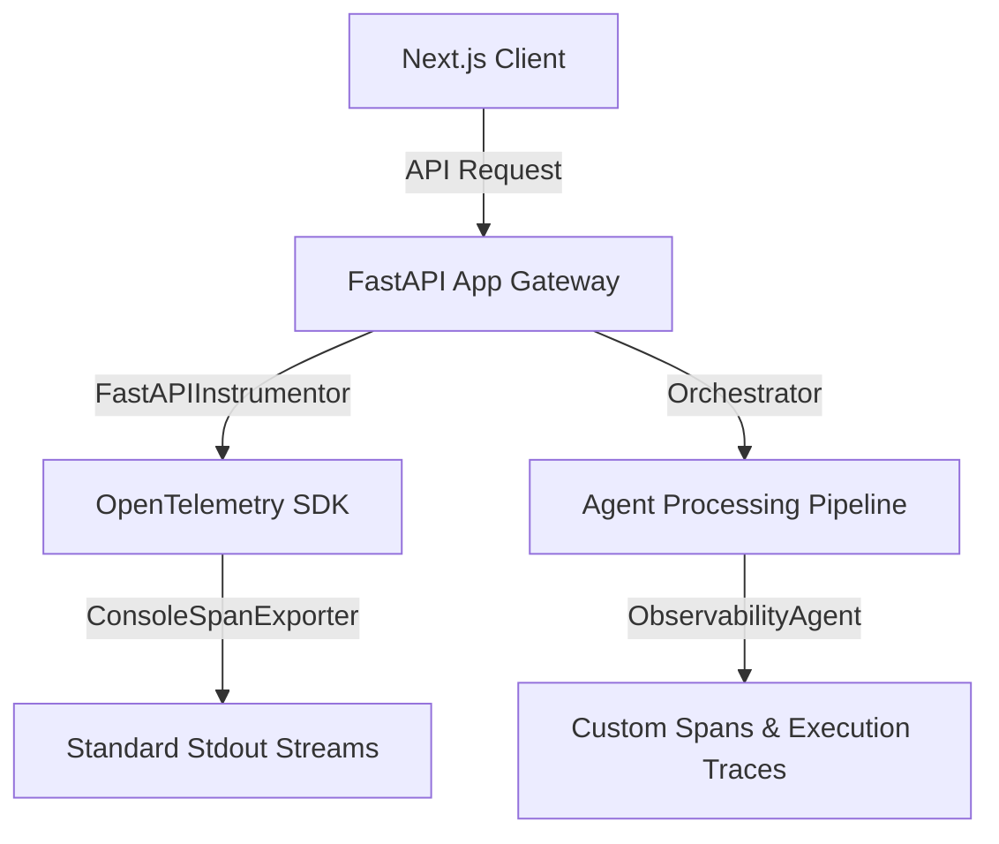

# 🩺 Observability Stack Architecture

This document describes the OpenTelemetry tracing, profiling, and telemetry architecture implemented within the AI-Powered Job Discovery monorepo, in compliance with standard **Twelve-Factor App Telemetry guidelines**.

---

## 🗺️ 1. Architecture Overview



To ensure strict operational safety and full traceability, we run a unified observability stack:
1. **Automated Request Instrumentation**: All incoming HTTP traffic is traced from entry to exit via the `FastAPIInstrumentor` middleware.
2. **AI Agent Pipeline Profiling**: Every individual agent step (scraping, safety gating, ranking, RAG extraction) is captured inside a nested OpenTelemetry Span to measure precise token latencies and failure rates.
3. **Structured Logging Outflow**: In accordance with Twelve-Factor App principles, traces and metrics flow directly out of standard output streams, where they can be captured by aggregators (Prometheus, Datadog, or Grafana).

---

## 🛠️ 2. The Observability Agent

Located at [observability_agent.py](file:///Users/qasirmehmood/Projects/qasir-proflle-2026/job-discovery/backend/agents/observability/observability_agent.py), the `ObservabilityAgent` provides standardized trace primitives.

### Usage in code:
```python
from backend.agents.observability.observability_agent import ObservabilityAgent

obs = ObservabilityAgent()

# Trace a custom code block / agent run:
with obs.trace_agent_execution("linkedin-scraper") as span:
    # Scraper logic executes here
    span.set_attribute("jobs.scraped_count", 5)
```

---

## ⚙️ 3. Environment Configurations

Configure tracing and error capturing in your `.env` file:
```bash
# OpenTelemetry Exporter Endpoint
OTEL_EXPORTER_OTLP_ENDPOINT=http://localhost:4317

# Pinned Service Info
OTEL_SERVICE_NAME=job-discovery-api
```
