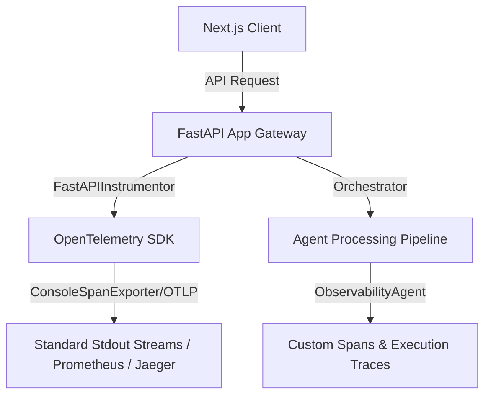

# 🩺 Observability Stack Architecture

This document serves as the single source of truth for all observability standards, tracked metrics, alerting thresholds, and Loki query examples for the AI-Powered Job Discovery platform.

---

## 🗺️ 1. Architecture Overview



---

## 📊 2. Tracked Metrics & Alerting Thresholds

All custom metrics must be implemented using OpenTelemetry's `MeterProvider`. 

| Metric Name | Type | Labels | Alert Threshold | Description |
|---|---|---|---|---|
| `jobs_scraped_total` | Counter | `source_id` | Delta = 0 for > 6 hours | Total jobs scraped from a source. |
| `ranking_duration_seconds` | Histogram | `agent_id` | p95 > 30s | Latency of the ranking agent. |
| `llm_tokens_used_total` | Counter | `agent_id`, `model` | > 20% over `CONTRACT.md` budget | Total token usage per agent. |
| `schema_conformance_rate` | Gauge | `agent_id` | < 99% | Rate of successful structured output parsing. |
| `hallucination_rate` | Gauge | `agent_id` | > 1% | Rate of hallucinated outputs detected by DeepEval. |
| `retrieval_precision` | Gauge | None | < 0.80 | RAG ContextPrecision score. |
| `reranker_confidence_p50` | Gauge | None | < 0.70 | Median confidence score of the reranker. |
| `agent_failure_total` | Counter | `agent_id`, `error_type` | N/A | Total number of unhandled exceptions per agent. |
| `api_request_duration_seconds` | Histogram | `endpoint`, `method` | p50 & p95 tracked | API route latency. |
| `dlq_depth` | Gauge | None | > 10 | Number of items currently in the Dead Letter Queue. |

---

## 🚨 3. Alert Routing

Alerts generated by Prometheus/Grafana evaluate the thresholds above and route appropriately:
- **Critical Alerts**: Routed to **Sentry** (e.g., hallucination > 1%, schema conformance < 99%, DLQ > 10).
- **Warning Alerts**: Routed to structured JSON logs via `get_logger` (e.g., token usage approaching budget).

---

## 🛑 4. Cardinality Constraints

**CRITICAL**: Metrics must **not** use high-cardinality labels. 
Labels such as `job_id`, `user_id`, or `session_id` are strictly prohibited on all Prometheus metrics. High cardinality causes memory exhaustion in Prometheus. Use low-cardinality labels only (e.g., `agent_id`, `source_id`, `model`, `log_level`).

---

## 🔎 5. Loki Query Examples

Loki aggregates our standard JSON stdout logs. Promtail is configured to parse fields from the JSON log line into searchable labels.

**Filter by Agent Name:**
```logql
{container_name="backend"} | json | agent="ranking"
```

**Filter by Source ID and Log Level (e.g. Find scraping errors):**
```logql
{source_id="linkedin", log_level="ERROR"}
```

**Search for specific text within a component:**
```logql
{container_name="backend"} |= "circuit breaker opened"
```

---

## ⏱️ 6. Temporal Trace Context Propagation

To trace executions end-to-end across asynchronous background workflows:
1. **Injection**: When starting a Temporal workflow from FastAPI, inject the current OpenTelemetry `TraceContext` into the Temporal workflow headers.
2. **Extraction**: Inside the Temporal activity worker, extract the trace context from the headers and attach it to the current span.
This ensures Jaeger visualizes the API request, the workflow execution, and the background agent execution as a single continuous trace.

---

## 🔗 7. References

This observability standard is referenced by:
- `backend/agents/observability/AGENT.md`
- `docs/ARCHITECTURE.md`
